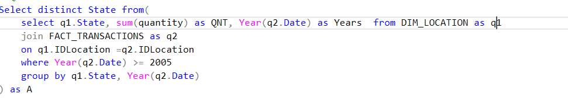
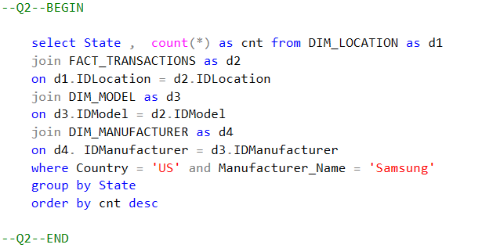
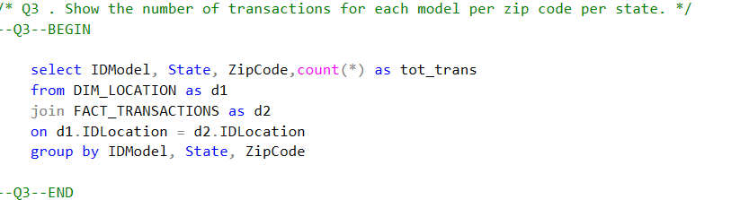
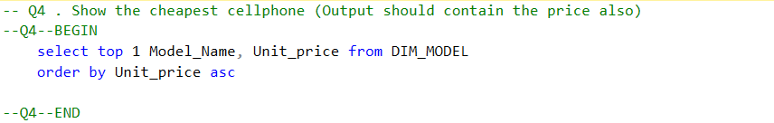
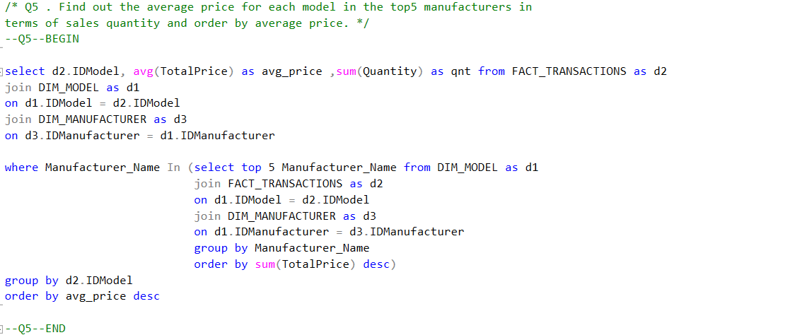
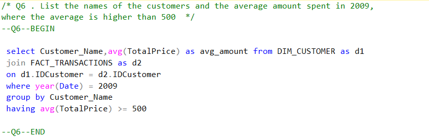
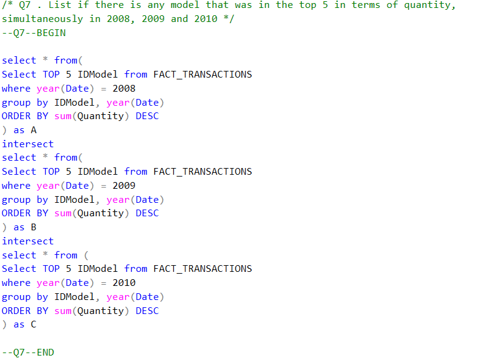
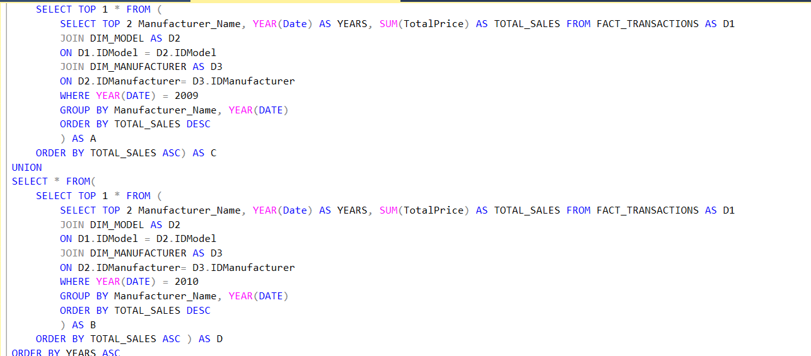
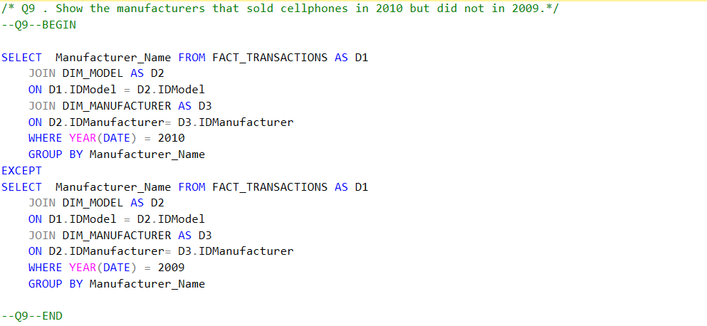
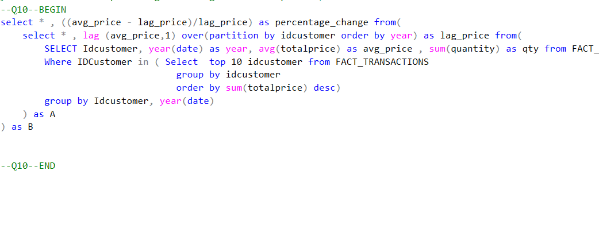

# Mobile-Manufacturing-Sales-Analysis-Using-SQL

##  Project Overview
This SQL case study analyzes the sales data of a mobile manufacturing company using a structured relational schema. The goal is to derive actionable insights related to customers, products, sales trends, geography, and performance across years.

##  Schema Design
The project uses a normalized star schema consisting of:
- `Dim_Manufacturer`: Manufacturer information  
- `Dim_Model`: Mobile model linked to manufacturer  
- `Dim_Customer`: Customer details  
- `Dim_Location`: State and ZIP-level geolocation  
- `Fact_Transactions`: Transaction-level data including quantity and revenue

> All tables were created manually, as data access was not provided.

---

##  Tools Used
- **SQL Server Management Studio (SSMS)**  
- **SQL (Advanced)** – including `JOIN`, `GROUP BY`, `CTE`, `INTERSECT`, `EXCEPT`, `RANK()`, `LAG()`, subqueries, and window functions

---

## Business Questions & Insights

### 1.  List all the states with customers who purchased phones from 2005 onward.
📷 

---

### 2.  Which U.S. state buys the most 'Samsung' phones?
📷 

---

### 3.  Transactions by model per ZIP code per state
📷 

---

### 4.  What is the cheapest cellphone? (Include price)
📷 

---

### 5.  Average price per model among top 5 manufacturers by quantity
📷 

---

### 6.  Customers with avg. spend > ₹500 in 2009
📷 

---

### 7.  Any model in top 5 quantity-wise for **2008, 2009, and 2010** simultaneously
📷 

---

### 8.  Second top manufacturer by sales in **2009 and 2010**
📷 

---

### 9.  Manufacturers who sold phones in **2010 but not in 2009**
📷 

---

### 10.  Top 100 customers: Avg. spend, quantity by year, % change in spend
📷

---

##  Key Outcomes
- Identified **top-performing models** and **manufacturers** by year  
- Highlighted **year-over-year customer spend trends** using `LAG()`  
- Analyzed **regional sales performance** by state and ZIP  
- Uncovered models consistently in **top 5 across 3 years**  
- Segmented customers by **transaction volume and revenue behavior**

---

##  Repository Structure
